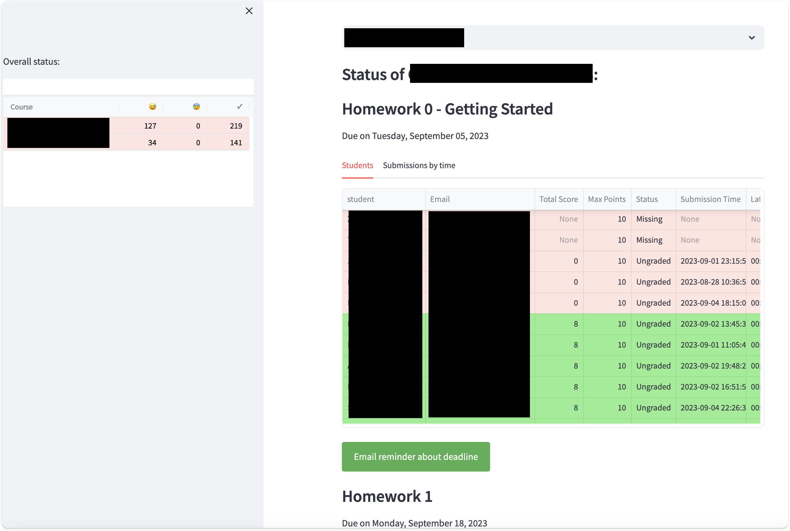

# Teaching Dashboard

Welcome to the Teaching Dashboard, built for the [Computer and Information Science Department](https://www.cis.upenn.edu/)!  This project develops a *data dashboard* and grading platform for courses that combine *Canvas*, *Gradescope*, and spreadsheet (shared Excel or Google Sheets) components.  It has two roles:

* Continuous monitoring of student progress (including missed deadlines and low scores).  This could ultimately be used to define triggers.
* Grade assessment / grade finalizaiton across different components.  Adjust thresholds, see histograms!

Our goal is a single aggregation point for tracking student progress (and triggering alarms as appropriate) across many courses.  Ultimately there will be both "pull" and "push" components (messages vs dashboard).  Through a shared spreadsheet the teaching and advising staff can keep notes about each student, in addition to the data in Gradescope and Canvas.



We pull from both the Gradescope and Canvas APIs.  In addition, various mechanisms have been implemented to allow the grades in one system (e.g., Gradescope) override the (potentially partly synced) grades in the other system.  Additional fields can be maintained by the staff, including e.g., *Adjustments*, *Comments*, and *Participation*, through an Excel sheet (which can be concurrently edited in Google Sheets).

## Getting Started

This library requires a bit of setup to ensure it crawls Gradescope and Canvas appropriately.

### Pre-configuration

You'll need to separately install the [Gradescope-Canvas Crawler] project, which shares some basic functionality (and can share the same `config.yaml` configuration file, using different keys).  Follow the instructions there to set up access to Canvas and Gradescope.  In the `config.yaml` file for that project, set the `db` key to a database path that will be shared between the crawler (that project) and the dashboard (this project).

For the dashboard, you will want to edit the corresponding `config.yaml` (you can copy from `config.yaml.default` here) and make sure the `db` matches the same file as the crawler's output.  You may also want to update the rubric (below)

### Setting up Your Python Environment

We assume Python 3.9 or higher.  Set up and run an Anaconda environment (you may need to substitute `python3` and `pip3` for `python` and `pip` below, depending on your setup):

```bash
python -m venv venv
chmod +x venv/bin/activate
source venv/bin/activate
pip install -r requirements.txt
```

Now you should be ready to do your first crawl!

### Seeing/updating the data manually
You should be able to run `sqlite3` followed by `.open dashboard.db` to access the database.  `.tables` will show all tables, `.schema {tablename}` will show the schema, `select * from {tablename}` will show contents. Use `.quit` to exit.

## Assignments

By default, the Teaching Dashboard pulls all Assignments from Canvas (including info on late penalties applied).  It pulls all Assignments from Gradescope, including how late they are (we assume the teaching staff have already applied adjustments for late penalties).

**There are functions to display student progress for all assignments, but you probably want to cluster your assignments in a *Rubric*.**

## Classifying Your Assignments: Rubrics

Virtually every class categorizes different deliverables and assigns a point value.  To get a birds-eye view of progress, you may want to set up a *grading rubric* in your `config.yaml` file.  Towards the end of the sample file you should see something like this:

```
rubric:
  1234:
    midterm1:
      substring: Midterm 1
      points: 15
      max_score: 80
      max_extra_credit: 0
      source: Gradescope
    quizzes:
      substring: review
      points: 7
      max_score: 210
      max_extra_credit: 0
      source: Canvas
```

The first key (`1234`) represents the *Canvas SIS Number* for your course.  You can easily get this by logging into your course Canvas site and looking at the number at the end of the URL.

Next we have a series of blocks representing different rubric components.  You can name each key as you prefer; each will show up as a score component table and as a column in the student scores.  There are several important keys to specify:

* `substring`.  The Dashboard will collect every Assignment in Gradescope and in Canvas.  Anything which has a name matching the `substring` will be considered part of this rubric item.

* `source` (optional).  Sometimes Canvas and Gradescope will be partly synced. You can limit your rubric item to only consider `Canvas` entries or only consider `Gradescope` entries. By default it considers any source.

* `points`. How many points in your final rubric (e.g., percentage points) is this item worth?

* `max_score` (optional). Sometimes you will allow for extra credit or other items.  The `max_score` represents the baseline for 100% credit. Default: the maximum score comes from the Gradescope or Canvas entry.

* `max_extra_credit` (optional). If students are allowed to exceed the `max_score`, do we threshold the extra credit? Default: no threshold.

### Supplemental Fields

For many courses, we would like to include additional information throughout the semester, which does not have a natural home in Gradescope or Canvas. Fortunately the Teaching Dashboard easily accommodates!

You may add *supplemental fields* to the rubric, e.g., for course participation, late penalties, etc.  These should be in an Excel spreadsheet called `more-fields-{canvas_SIS_number}.xlsx`, along with student info from Gradescope *(First Name, Last Name, SID, Email)*.

A template is provided as *more-fields-1234.xlsx* and you may copy it to your course number. It's suggested you download the Gradescope grade file and copy the leftmost few fields directly into this sheet.

Suggested fields include **Adjustments** (added to the final student score, without any scaling and without counting against the baseline), **Comments** (notes shown in the output table as grade assignments are done), and possibly **Participation** if you do not track this through quizzes or other mechanisms. Optionally one might include **Penalties**, e.g., for academic integrity issues.

## Potential Future To-Dos:
* Add auto late penalties in the system.
* In-dashboard generation of config files?

